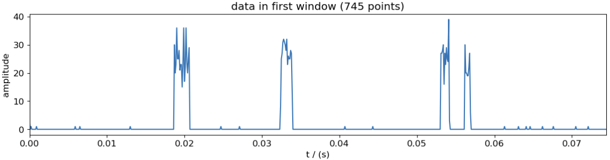

# MarkovAnalyzer: Analysis of Markov In Python Made Easy 
by M. Sifft and D. Hägele

We present a fast Python toolbox for analysing Markov Systems using the Foreward algorithm or a polyspectra fit

Here, a few outstanding features of MarkovAnalyzer:
* 

## Installation
SignalSnap is available on `pip` and can be installed with 
```bash
pip install markovanalyzer
```

### Installation of Arrayfire
Besides running on CPU, MarkovAnalyzer offers GPU support for Nvidia and AMD cards. Depending on the hardware used, the
usage of a GPU is highly recommended for Markov systems with more 
than about 100 states. A comprehensive installation guide for Linux + NVidia GPU can be found [here](https://github.com/MarkusSifft/QuantumCatch/wiki/Installation-Guide). 
For GPU calculations the high performance library Arrayfire is used. The Python wrapper ([see here](https://github.com/arrayfire/arrayfire-python)) 
is automatically installed when installing SignalSnap, however, [ArrayFire C/C++ libraries](https://arrayfire.com/download) need to be installed separately. 
Instructions can be found can be found [here](https://github.com/arrayfire/arrayfire-python) and [here](https://arrayfire.org/docs/installing.htm#gsc.tab=0).

## Documentation
The documentation of the package can be found [here](https://markussifft.github.io/QuantumCatch/). 
The package is divided into two parts: the **polyspectra-calculator** module, the **fitting-tools** module, 
and the **forward** module.
### Polyspectra-Calculator Module
The Simulation Module allows for the calculation of the theoretical quantum 
polyspectra directly from the system's transition matrix.
### Fitting-Tools Module
The Fitting-Tools Module enables a user-friendly characterization of a Markov system in the lab based on the 
polyspectra of a measurement of a Markov process. These polyspectra can be calculated
via our [SignalSnap](https://github.com/MarkusSifft/SignalSnap) package. After providing a model transition matrix with
one or more variable parameters, these parameters are estimated by fitting the theoretical model prediction of the 
polyspectra to their measured counterparts.
### Forward Module
Here, the Forward Algorithm for the estimation of Markov models is implemented.

## Example: Characterization of a Two-State Markov Model
We want to deduce a Markov model (i.e., it's transition matrix) from the observation of the Markov process. We are given 
data, that looks like this:



This is only a short excerpt of the full dataset. 


